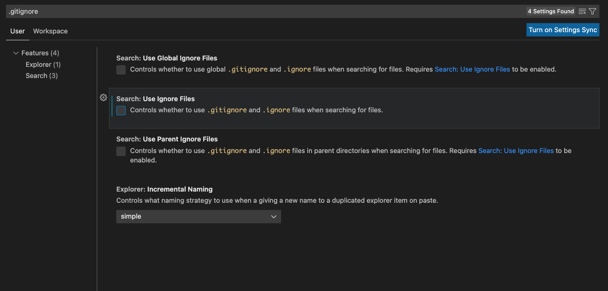
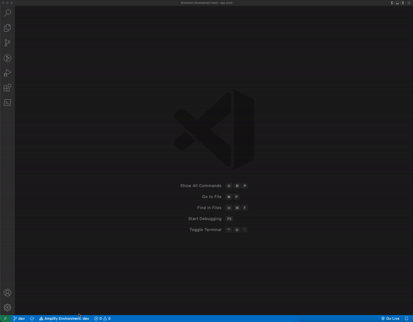

# AWS Amplify Environments

This extension displays the current name of the local Amplify environment in the status bar of VS code. If you click on the extension in the status bar, you can change the environment graphically. This extension also notifies you with an information message when you change the environment.

## Setup

When you use the ```amplify checkout env``` command, Amplify updates the ```/amplify/.config/local-env-info.json``` file.

The extension looks for changes in this file and displays the env name from this file. This file is located in .gitignore, which prevents the File System Watcher from finding the file and displaying the env name. You must have **Search: Use Ignore Files** disabled to enable this extension to work.



## Use


